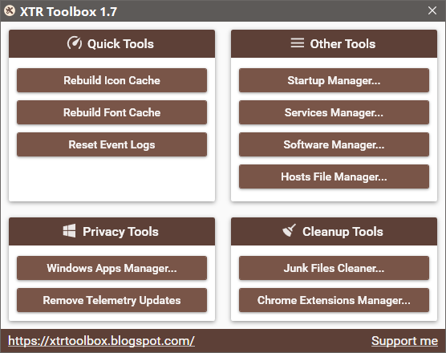

<h1 align="center">
XTR Toolbox
</h1>

Portable tool to tweak, clean and optimize Windows.
 🚀 E<b>xtr</b>emely fast. 🚀
 
 
 

 
 

## Supported platforms:
- Windows 10, Windows 11 - x64 only (Use **v2.1** for x32)
- .Net Framework: 4.8 (Included with Windows 10 1903+)
- (Note: **Windows 7 && Windows 8** support is deprecated)

## Features Overview:

#### Main Tools:
- Batch Startup Manager
  - Create startup entries
  - Log startup changes
  - Export startup list [Clipboard]
  - Displays invalid entries
- Batch Services Manager
  - Log service changes
  - Export services list [Clipboard]
- Batch Software Manager
  - Log software changes
  - Export software list [Clipboard]
  - Force remove software
  - Silently remove software (MSI)
- Hosts File Editor / Manager
- Quick Tools
  - Rebuild Icon Cache
  - Rebuild Font Cache
  - Reset Event Logs

#### Privacy Tools:
- Remove / Reinstall Windows Apps
  - Detects currently present apps

#### Cleanup Tools: 
- Junk Files Cleaner:
  - Filter by date
  - Filter by custom extensions
  - Cleaning support:
    - User and Windows Temporary Directories
    - Windows Installer Cache
    - Windows Update Cache
    - Windows Logs Directory
    - Prefetch Cache
    - Crash Dump Directory
    - Google Chrome Cache
    - Steam Redistributable Packages
- Chrome Extensions Manager

#### Other:
- Automatic Dark / Light mode (Also configurable)

## What sets this toolbox apart from many others?
Unlike other apps, this toolbox aims to:
- Be fast and lightweight regardless of feature set
- Use modern technologies
- Have no ads, unnecessary things, or bloat
- Support latest version of Windows
- Be easy to use and have a good looking interface

## Project Goals - Plans
- To add a lot more features (see backlog)
- Translate to other languages
- Help wiki
- You can request a feature, open for all kinds of suggestions
- Get feature parity with other toolbox suites

## Support me if you enjoy my software or spread the word
<a href="https://github.com/sponsors/Zeeex">
Become a GitHub sponsor
</a>
 
Every bit helps and will enable me to focus more time on development.
 

## Backlog
Software manager:
- Software update checker & downloader
- Automatically download and install software (with configuration per setup)
- Batch software installer
- More control over force uninstalling
- Detection of different installers and uninstallers (Inno, NSIS, Msi,...)

Services manager:
- Preset services changer (Batch services changes based on definition file)
- Services progress bar when changing
- Better error handling
- Add color coding for easier management of their change severity and recommendation
- Add memory usage for running services

Autoruns manager:
- Check startup entries against known definition file for their validity (hosted on github)
- More options when creating a new startup entry

Junk Files Cleaner:
- Improve scanning process (offer to cancel, improve scan progress)

General:
- Add a post scan / clean / tweak option (like restarting / shutting down PC)
- Add a CLI interface for all tools
- Add a logger so the user can report bugs / features easily
- Add option to disable / tweak Windows bloat (all range of options)
- Add option to manage invalid shortcuts (remove and repair)
- Add option to manage context menu items (remove, change, and repair)
- Add option to change windows theme (dark/light) based on timed settings
- Add option to save / restore desktop icons and their layout
- Add option to export data to all kind of formats (text, csv, xml, json, xlsx)
- Add autoupdater (user changeable)
- Add duplicate files finder
- Add checksum files comparer (MD5, SHA1, SHA2, ...)
- Add option to save configuration (file / registry config) (this is still under consideration)
- Add option to schedule tools to run at specified time (using Task Scheduler)
- Add option to run several tools in succession
- Add option for scripts so any user can add their own tweaks to the tool
- Improve scan speed for all tools

## Download
Latest release [page](https://github.com/Zeeex/XTR-Toolbox/releases/latest).

## Build tools
- Visual Studio 2022 (Probably works on older versions too)
- Windows 10 SDK (Project requests by default 10.0.18362.0 (Win 1903)) - Integrated into project

## Reviews
- [MajorGeeks](http://www.majorgeeks.com/files/details/xtr_toolbox.html)  
- [Softpedia](http://www.softpedia.com/get/PORTABLE-SOFTWARE/System/System-Enhancements/XTR-Toolbox.shtml)  
- [chip.de](http://www.chip.de/downloads/XTR-Toolbox_131625845.html) - [Rated best freeware](http://www.chip.de/bildergalerie/Freeware-des-Monats-2018-Galerie_130718114.html) of february 2018, [v2.1 Review](http://www.chip.de/news/Update-fuer-XTR-Toolbox-CCleaner-Alternative-entfernt-Windows-Apps-noch-zuverlaessiger_131614814.html)  
- [Trishtech.com](https://www.trishtech.com/2018/01/xtr-toolbox-portable-windows-tweaker-and-optimizer/)  
- [WinTotal.de](https://www.wintotal.de/download/xtr-toolbox/)
